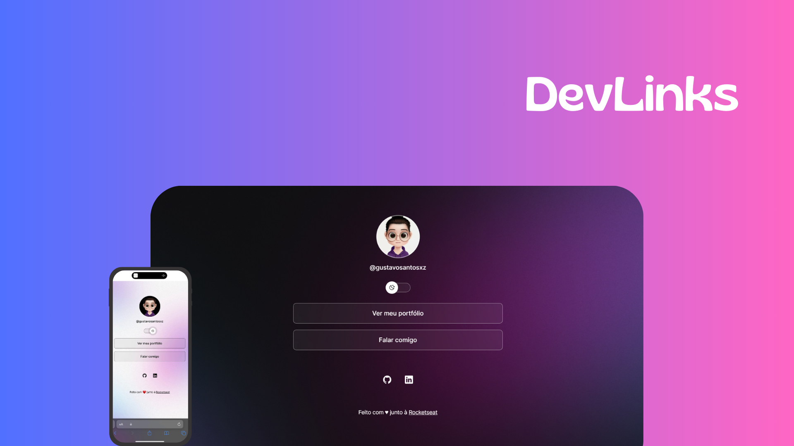

<h1 align="center"> DevLinks </h1>

Projeto criado por mim através do curso Discover, promovido de forma gratuita pela Rocketseat para ensino de tecnologias WEB.

  

 

  

 

## 🚀 Tecnologias

Esse projeto foi desenvolvido utilizando as seguintes tecnologias:

- HTML e CSS
- JavaScript
- Git e Github
- Figma

## 💻 Projeto

O DevLinks é um agregador de links para ser utilizado como um cartão de visitas online.

- Acesse o projeto finalizado [clicando aqui](https://gustavosantosxz.github.io/DevLinks/)

## 🔖 Layout

Você pode visualizar o layout do projeto através [desse link](https://www.figma.com/community/file/1187422022288947321). Não se esqueça que é necessário ter uma conta no [Figma](https://figma.com) para acessá-lo.

## 📒 Licença

Esse projeto está sob a licença MIT.

---

Feito com ♥ junto à Rocketseat :wave: [Participe da comunidade!](https://discord.gg/rocketseat)
